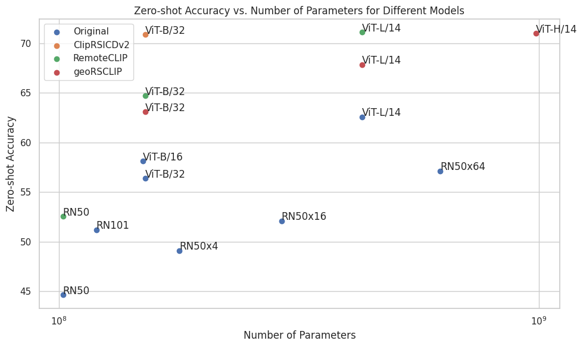

<center> 
<h1><strong>Evaluate and benchmark your vision language embedding model for remote sensing applications</strong></h1>
<em>
Alberto Frizzera, info@albertofrizzera.com<br>
Riccardo Ricci, riccardo.ricci-1@unitn.it
</em>
<br>
</center>

## Introduction
This project aims at developing a platform for benchmarking of vision-language models in the remote sensing scenario. 

## Disclaimer
There is no restriction on the model type. The only requirement is providing these three things:
1. A function to load the model. This function must return three callables: model, textprocessor, imageprocessor.
- The model is the model itself.
- Textprocessor is a function that takes in input a list of strings and tokenize them, producing in output a tensor of indices of size BxL (tensors padded at the maximum length). 
- Imageprocessor is a function that takes in input a single PIL Image and apply transformations on it, producing in output a tensor of size CxHxW.

2. A function to produce text embeddings. This function takes in input the model, the texts (list of strings), and the device. It then preprocess the text with textprocessor and produce embeddings with the model. It returns the embeddings, a tensor of shape BxD, where D is the embedding dimension.

3. A function to produce image embeddings. This function takes in input the model, the images (list of PIL.Image objects), and the device. It then preprocess the images with imageprocessor and produce embeddings with the model. It returns the embeddings, a tensor of shape BxD, where D is the embedding dimension.

You can find some examples of the implementation of these functions in ```utils.py```. Specifically, functions to load remoteCLIP, georsCLIP, CLIPrsicdv2 and openaiCLIP have been implemented. 

## Installation
1. Create a conda environment following the instructions contained in ```environment.txt``` or using ```requirements.txt```.
2. Adjust the environmental variables of the dataset in ```.env``` in order to properly locate the datasets.

> **_Note:_**  We are working to provide instructions to download and prepare all the datasets.

## Usage
1. Modify the beginning of the module ```eval.py``` by importing your custom functions, and replacing them after "load_function", "encode_text_fn" and "encode_image_fn".
2. Modify the templates, placing the ones that you want to use for evaluation.
3. Run ```eval.py```.
4. Collect the results in the ```reports/``` folder saved in a Latex document.

## Benchmark Datasets
The following list provides the datasets used to benchmark your model.

### Zero shot classification
- [X] [UCM](http://weegee.vision.ucmerced.edu/datasets/landuse.html)
- [X] [WHU_RS19](https://captain-whu.github.io/BED4RS/#)
- [X] [RSSCN7](https://github.com/palewithout/RSSCN7)
- [X] [SIRI_WHU](http://www.lmars.whu.edu.cn/prof_web/zhongyanfei/e-code.html)
- [X] [RESISC45](https://figshare.com/articles/dataset/NWPU-RESISC45_Dataset_with_12_classes/16674166)
- [X] [RSI_CB128](https://github.com/lehaifeng/RSI-CB)
- [X] [RSI_CB256](https://github.com/lehaifeng/RSI-CB)
- [X] [EuroSAT](https://github.com/phelber/eurosat)
- [X] [PatternNet](https://sites.google.com/view/zhouwx/dataset)
- [X] [OPTIMAL_31](https://huggingface.co/datasets/jonathan-roberts1/Optimal-31)
- [X] [MLRSNet](https://github.com/cugbrs/MLRSNet)
- [X] [RSICD](https://github.com/201528014227051/RSICD_optimal)
- [X] [RSITMD](https://github.com/xiaoyuan1996/AMFMN)


### Image retrieval
- [X] [RSICD](https://github.com/201528014227051/RSICD_optimal)
- [X] [RSITMD](https://github.com/xiaoyuan1996/AMFMN)
- [X] [SIDNEY](https://mega.nz/folder/pG4yTYYA#4c4buNFLibryZnlujsrwEQ)
- [X] [UCM](https://mega.nz/folder/wCpSzSoS#RXzIlrv--TDt3ENZdKN8JA)

Datasets marked with [X] are already implemented and ready to use.

We are constantly updating the number of datasets that we support for testing. 
If needed, an exhaustive list of other satellite datasets is available [here](https://captain-whu.github.io/DiRS/).

To visualize the samples of all the above datasets, a web tool has been implemented (```web_app/main.py```)

## Benchmark Models
The following figures report some baselines of CLIP-like models. Some are original, while others are finetuned for the remote sensing scenario.

For a detailed breakdown on each dataset, refer to the [report](reports/single_model_breakdown.md).

### Zero-shot classification accuracy (%)


### Linear probe accuracy (%)


## Dataset preparation
Each dataset should be downloaded and preprocessed. For each dataset, we delineate below the steps to accomplish to prepare it for the benchmarking.
First, create a folder named "benchmarks", wherever you want, and put its path in the .env file.

### UCM
1. Download the file ``UCM_captions.zip`` from [here](https://mega.nz/folder/wCpSzSoS#RXzIlrv--TDt3ENZdKN8JA).
2. Extract the zip file and open its content.
3. Rename the file ``dataset.json`` into ``captions.json`` and put it under ``dataset/benchmarks/UCM/labels/``.
4. Extract ``imgs.rar`` and put its content into ``dataset/benchmarks/UCM/images/captions/``.
5. Download the file ``UCMerced_LandUse.zip`` from [here](http://weegee.vision.ucmerced.edu/datasets/landuse.html).
6. Extract the zip file and open its content.
7. Copy the content of the folder ``Images`` into ``dataset/benchmarks/UCM/images/labels/``.
8. Prepare the dataset using ``dataset/benchmarks/UCM/build_labels.ipynb`` and ``dataset/benchmarks/UCM/build_captions.ipynb``.

### WHU_RS19
1. Download the file ``WHU-RS19.zip`` from [here](https://captain-whu.github.io/BED4RS/#).
2. Extract the zip file and copy its content into ``dataset/benchmarks/WHU_RS19/images/``.
3. Prepare the dataset using ``dataset/benchmarks/WHU_RS19/build_labels.ipynb``.

### RSSCN7
Steps:
1. Navigate to the "benchmarks" folder.
2. Clone the repository 
```bash
git clone https://github.com/palewithout/RSSCN7
```
3. Copy the file "metadata/RSSCN7/RSSCN7.pkl" inside "benchmarks/RSSCN7".

This dataset does not provide train-test-val splits in literature. We created random train-test-val splits using stratification, to ensure that the classes are balanced in each split.

### SIRI_WHU

### RESISC45
1. Download the file ``NWPU_RESISC45-20210923T210241Z-001.zip`` from [here](https://figshare.com/articles/dataset/NWPU-RESISC45_Dataset_with_12_classes/16674166).
2. Extract the zip file and copy its content into ``dataset/benchmarks/RESISC45/images/``.
3. Prepare the dataset using ``dataset/benchmarks/RESISC45/build_labels.ipynb``.

### RSI_CB256
1. Download the file ``RSI-CB256.rar`` from [here](https://github.com/lehaifeng/RSI-CB).
2. Extract the rar file and copy its content into ``dataset/benchmarks/RSI_CB256/images/``.
3. Prepare the dataset using ``dataset/benchmarks/RSI_CB256/build_labels.ipynb``.

### EuroSAT
1. Download the file ``EuroSAT.zip`` from [here](https://github.com/phelber/eurosat).
2. Extract the zip file and copy its content into ``dataset/benchmarks/EuroSAT/images/``.
3. Prepare the dataset using ``dataset/benchmarks/EuroSAT/build_labels.ipynb``.

### PatternNet
1. Download the file ``PatternNet.zip`` from [here](https://sites.google.com/view/zhouwx/dataset).
2. Extract the zip file and open its content.
3. Copy the content of the folder ``images`` into ``dataset/benchmarks/PatternNet/images/``.
4. Prepare the dataset using ``dataset/benchmarks/PatternNet/build_labels.ipynb``.

### OPTIMAL_31
1. Download the file ``archive.zip`` from [here](https://www.kaggle.com/datasets/brajrajnagar/optimal-31).
2. Extract the zip file and open its content.
3. Copy the content of the folder ``Images`` into ``dataset/benchmarks/OPTIMAL_31/images/``.
4. Prepare the dataset using ``dataset/benchmarks/OPTIMAL_31/build_labels.ipynb``.

### MLRSNet
1. Download the file ``MLRSNet A Multi-label High Spatial Resolution Remote Sensing Dataset for Semantic Scene Understanding.zip`` from [here](https://github.com/cugbrs/MLRSNet).
2. Extract the zip file and open its content.
3. Copy the content of the folder ``Labels`` into ``dataset/benchmarks/MLRSNet/labels/data/``.
4. Extract each rar file of the folder ``Images`` into ``dataset/benchmarks/MLRSNet/images/``.
5. Prepare the dataset using ``dataset/benchmarks/MLRSNet/build_labels.ipynb``.

### RSICD
1. Download the file ``RSICD_optimal-master.zip`` from [here](https://github.com/201528014227051/RSICD_optimal).
2. Extract the zip file and open its content.
3. Copy the file ``dataset_rsicd.json`` into ``dataset/benchmarks/RSICD/labels/sentences/``.
4. Extract the file ``txtclasses_rsicd.rar`` and copy its content into ``dataset/benchmarks/RSICD/labels/classes/``.
5. Extract the file ``RSICD_images.zip`` and copy its content into ``dataset/benchmarks/RSICD/images/``.
6. Prepare the dataset using ``dataset/benchmarks/RSICD/build_labels.ipynb``.

### RSITMD
1. Download the file ``RSITMD.zip`` from [here](https://github.com/xiaoyuan1996/AMFMN).
2. Extract the zip file and open its content.
3. Copy the content of the folder ``images`` into ``dataset/benchmarks/RSITMD/images/``.
5. Copy the file ``dataset_RSITMD.json`` into ``dataset/benchmarks/RSITMD/labels/``.
4. Prepare the dataset using ``dataset/benchmarks/RSITMD/build_labels.ipynb``.

### SIDNEY

