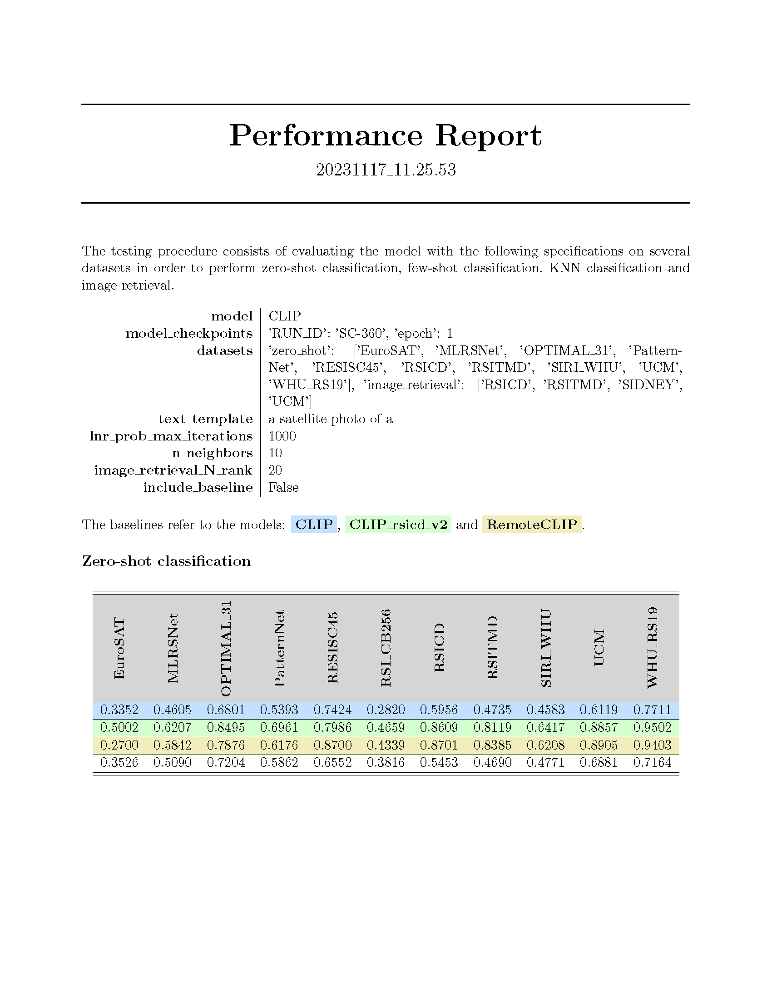

<center> 
<h1><strong>A benchmark for the evaluation of vision language embeddings for remote sensing applications</strong></h1>
<em>
Alberto Frizzera, info@albertofrizzera.com<br>
Riccardo Ricci, riccardo.ricci-1@unitn.it
</em>
<br>
</center>

## Introduction
This project aims at developing a platform for benchmarking of vision-language models in the remote sensing scenario. 

### DISCLAIMER
There is no restriction on the model type. The only requirement is that the model obey to three things:
1. Provide a preprocess function to preprocess the images.
2. Have an "encode_image" function, which takes a list of images and produces a list of embeddings. The images are supposed to be already preprocessed. 
3. Have a preprocess_text function to preprocess the text.
4. Have an "encode_text" function, which takes a list of texts and produces a list of embeddings. The texts are supposed to be already preprocessed.

## Installation

1. Create a conda environment following the instructions contained in ```environment.txt``` or using ```requirements.txt```.
2. Adjust the environmental variables of the dataset in ```.env``` in order to properly locate the datasets.

> **_Note:_**  The processed datasets will be available soon.

## Usage
1. Run the ```test.py``` by specifying the test parameters.
2. Collect the results in the ```reports/``` folder saved in a Latex document.

## Benchmark Datasets

The following list provides the datasets used to benchmark your model.

### Zero shot classification
- [X] [UCM](http://weegee.vision.ucmerced.edu/datasets/landuse.html)
- [X] [WHU_RS19](https://captain-whu.github.io/BED4RS/#)
- [X] [RSSCN7](https://github.com/palewithout/RSSCN7)
- [X] [SIRI_WHU](http://www.lmars.whu.edu.cn/prof_web/zhongyanfei/e-code.html)
- [X] [RESISC45](https://figshare.com/articles/dataset/NWPU-RESISC45_Dataset_with_12_classes/16674166)
- [X] [RSI_CB128](https://github.com/lehaifeng/RSI-CB)
- [X] [RSI_CB256](https://github.com/lehaifeng/RSI-CB)
- [X] [EuroSAT](https://github.com/phelber/eurosat)
- [X] [PatternNet](https://sites.google.com/view/zhouwx/dataset)
- [X] [OPTIMAL_31](https://huggingface.co/datasets/jonathan-roberts1/Optimal-31)
- [X] [MLRSNet](https://github.com/cugbrs/MLRSNet)
- [X] [RSICD](https://github.com/201528014227051/RSICD_optimal)
- [X] [RSITMD](https://github.com/xiaoyuan1996/AMFMN)


### Image retrieval
- [X] [RSICD](https://github.com/201528014227051/RSICD_optimal)
- [X] [RSITMD](https://github.com/xiaoyuan1996/AMFMN)
- [X] [SIDNEY](https://mega.nz/folder/pG4yTYYA#4c4buNFLibryZnlujsrwEQ)
- [X] [UCM](https://mega.nz/folder/wCpSzSoS#RXzIlrv--TDt3ENZdKN8JA)

Datasets marked with [X] are already implemented and ready to use.

We are constantly updating the number of datasets that we support for testing. 
If needed, an exhaustive list of other satellite datasets is available [here](https://captain-whu.github.io/DiRS/).

To visualize the samples of all the above datasets, a web tool has been implemented (```web_app/main.py```)

## BASELINES
The following table report some baselines of CLIP-like models. Some are original, while others are finetuned for the remote sensing scenario.

All the zero-shot results are obtained using the following template "a remote sensing image of a {class}", where class is replaced by the class name.

### ORIGINAL CLIP MODELS FROM OPENAI
This tables reports the performance of the original CLIP models trained by OPENAI. You can find these models in their [github repository](https://github.com/openai/CLIP). 
### CLIP ViT-B/32
| Dataset    | Zero-shot Accuracy (%) | Linear-probe Accuracy (%) | Recall@K (T2I: R@1 / R@5 / R@10 / R@50) | Recall@K (I2T: R@1 / R@5 / R@10 / R@50) |
|------------|------------------------|---------------------------|----------------------------------------|----------------------------------------|
| UCM        | 64.52                  | 95.0                      | 8.57 / 36.67 / 60.57 / 94.76           | 10.95 / 29.52 / 52.38 / 88.57          |
| WHU_RS19   | 80.6                   | 99.0                      | -                                      | -                                      |
| RSSCN7     | 65.18                  | 94.64                     | -                                      | -                                      |
| SIRI_WHU   | 51.46                  | 93.96                     | -                                      | -                                      |
| RESISC45   | 75.52                  | 97.95                     | -                                      | -                                      |
| RSI_CB128  | 24.37                  | 98.19                     | -                                      | -                                      |
| RSI_CB256  | 34.02                  | 98.93                     | -                                      | -                                      |
| EuroSAT    | 39.83                  | 95.3                      | -                                      | -                                      |
| PatternNet | 58.83                  | 98.82                     | -                                      | -                                      |
| OPTIMAL_31 | 75.0                   | 93.82                     | -                                      | -                                      |
| MLRSNet    | 51.23                  | 93.77                     | -                                      | -                                      |
| RSICD      | 59.29                  | 94.69                     | 5.86 / 16.89 / 28.36 / 67.48           | 4.67 / 14.18 / 23.60 / 53.06          |
| RSITMD     | 53.54                  | 93.14                     | 8.72 / 27.79 / 42.57 / 77.57           | 9.51 / 23.01 / 34.07 / 62.39          |
| SIDNEY     | -                      | -                         | 12.07 / 41.38 / 68.97 / 100.00         | 12.07 / 39.66 / 55.17 / 86.21         |

### CLIP ViT-B/16
| Dataset    | Zero-shot Accuracy (%) | Linear-probe Accuracy (%) | Recall@K (T2I: R@1 / R@5 / R@10 / R@50) | Recall@K (I2T: R@1 / R@5 / R@10 / R@50) |
|------------|------------------------|---------------------------|----------------------------------------|----------------------------------------|
| UCM        | 70.24                  | 96.67                     | 9.81 / 39.14 / 66.57 / 94.76           | 8.10 / 38.10 / 61.43 / 93.33          |
| WHU_RS19   | 81.09                  | 99.0                      | -                                      | -                                      |
| RSSCN7     | 65.89                  | 93.04                     | -                                      | -                                      |
| SIRI_WHU   | 50.21                  | 93.75                     | -                                      | -                                      |
| RESISC45   | 72.19                  | 98.43                     | -                                      | -                                      |
| RSI_CB128  | 26.01                  | 98.28                     | -                                      | -                                      |
| RSI_CB256  | 37.9                   | 98.95                     | -                                      | -                                      |
| EuroSAT    | 44.91                  | 95.61                     | -                                      | -                                      |
| PatternNet | 64.49                  | 98.8                      | -                                      | -                                      |
| OPTIMAL_31 | 73.39                  | 93.82                     | -                                      | -                                      |
| MLRSNet    | 53.73                  | 94.58                     | -                                      | -                                      |
| RSICD      | 60.2                   | 96.25                     | 5.89 / 19.18 / 29.19 / 67.76           | 6.50 / 18.21 / 27.36 / 55.54          |
| RSITMD     | 55.75                  | 95.8                      | 8.14 / 29.12 / 46.02 / 80.00           | 11.28 / 25.00 / 33.63 / 61.95         |
| SIDNEY     | -                      | -                         | 11.03 / 47.93 / 69.31 / 100.00         | 8.62 / 27.59 / 53.45 / 91.38          |

### CLIP ViT-L/14
| Dataset    | Zero-shot Accuracy (%) | Linear-probe Accuracy (%) | Recall@K (T2I: R@1 / R@5 / R@10 / R@50) | Recall@K (I2T: R@1 / R@5 / R@10 / R@50) |
|------------|------------------------|---------------------------|----------------------------------------|----------------------------------------|
| UCM        | 73.1                   | 97.86                     | 10.67 / 45.71 / 73.05 / 97.62          | 9.52 / 38.57 / 65.24 / 93.33           |
| WHU_RS19   | 82.59                  | 100.0                     | -                                      | -                                      |
| RSSCN7     | 56.25                  | 95.18                     | -                                      | -                                      |
| SIRI_WHU   | 55.62                  | 95.21                     | -                                      | -                                      |
| RESISC45   | 83.14                  | 98.86                     | -                                      | -                                      |
| RSI_CB128  | 34.15                  | 98.65                     | -                                      | -                                      |
| RSI_CB256  | 46.26                  | 99.49                     | -                                      | -                                      |
| EuroSAT    | 48.98                  | 97.19                     | -                                      | -                                      |
| PatternNet | 71.07                  | 99.29                     | -                                      | -                                      |
| OPTIMAL_31 | 79.84                  | 97.31                     | -                                      | -                                      |
| MLRSNet    | 60.12                  | 95.99                     | -                                      | -                                      |
| RSICD      | 61.02                  | 96.25                     | 5.03 / 19.07 / 30.21 / 69.39           | 6.31 / 17.38 / 27.54 / 58.28           |
| RSITMD     | 61.5                   | 98.01                     | 11.42 / 32.92 / 47.35 / 79.78          | 10.62 / 28.10 / 39.16 / 67.70          |
| SIDNEY     | -                      | -                         | 14.83 / 47.59 / 70.69 / 100.00         | 13.79 / 39.66 / 51.72 / 87.93          |

### CLIP ViT-L/14@336px
| Dataset    | Zero-shot Accuracy (%) | Linear-probe Accuracy (%) | Recall@K (T2I: R@1 / R@5 / R@10 / R@50) | Recall@K (I2T: R@1 / R@5 / R@10 / R@50) |
|------------|------------------------|---------------------------|----------------------------------------|----------------------------------------|
| UCM        | 75.95                  | 98.33                     | 10.57 / 45.62 / 74.57 / 97.71          | 10.95 / 41.90 / 63.81 / 94.29          |
| WHU_RS19   | 82.59                  | 99.5                      | -                                      | -                                      |
| RSSCN7     | 58.39                  | 95.18                     | -                                      | -                                      |
| SIRI_WHU   | 55.0                   | 95.83                     | -                                      | -                                      |
| RESISC45   | 81.86                  | 99.19                     | -                                      | -                                      |
| RSI_CB128  | 33.33                  | 98.61                     | -                                      | -                                      |
| RSI_CB256  | 44.38                  | 99.6                      | -                                      | -                                      |
| EuroSAT    | 46.83                  | 97.15                     | -                                      | -                                      |
| PatternNet | 70.31                  | 99.42                     | -                                      | -                                      |
| OPTIMAL_31 | 82.26                  | 95.97                     | -                                      | -                                      |
| MLRSNet    | 59.62                  | 96.36                     | -                                      | -                                      |
| RSICD      | 60.02                  | 96.8                      | 5.64 / 20.86 / 31.56 / 71.62           | 6.77 / 17.57 / 26.72 / 58.19           |
| RSITMD     | 60.62                  | 98.23                     | 10.18 / 33.05 / 47.74 / 80.27          | 10.40 / 27.43 / 38.05 / 67.48          |
| SIDNEY     | -                      | -                         | 14.48 / 47.93 / 71.38 / 100.00         | 13.79 / 34.48 / 55.17 / 86.21          |


### RN50
| Dataset    | Zero-shot Accuracy (%) | Linear-probe Accuracy (%) | Recall@K (T2I: R@1 / R@5 / R@10 / R@50) | Recall@K (I2T: R@1 / R@5 / R@10 / R@50) |
|------------|------------------------|---------------------------|----------------------------------------|----------------------------------------|
| UCM        | 58.57                  | 93.33                     | 7.14 / 30.86 / 51.43 / 88.57           | 7.14 / 29.05 / 49.52 / 80.48           |
| WHU_RS19   | 67.66                  | 95.52                     | -                                      | -                                      |
| RSSCN7     | 50.36                  | 90.0                      | -                                      | -                                      |
| SIRI_WHU   | 29.79                  | 86.67                     | -                                      | -                                      |
| RESISC45   | 60.95                  | 95.14                     | -                                      | -                                      |
| RSI_CB128  | 19.68                  | 94.97                     | -                                      | -                                      |
| RSI_CB256  | 29.54                  | 96.99                     | -                                      | -                                      |
| EuroSAT    | 25.72                  | 91.22                     | -                                      | -                                      |
| PatternNet | 43.47                  | 97.88                     | -                                      | -                                      |
| OPTIMAL_31 | 63.71                  | 90.32                     | -                                      | -                                      |
| MLRSNet    | 41.23                  | 88.78                     | -                                      | -                                      |
| RSICD      | 47.67                  | 90.58                     | 4.34 / 13.92 / 22.87 / 57.99           | 5.03 / 12.81 / 18.85 / 45.93           |
| RSITMD     | 41.59                  | 85.84                     | 5.40 / 20.35 / 32.48 / 68.89           | 5.09 / 16.59 / 25.66 / 52.65           |
| SIDNEY     | -                      | -                         | 13.79 / 39.66 / 63.45 / 100.00         | 6.90 / 29.31 / 43.10 / 74.14           |

### RN101
| Dataset    | Zero-shot Accuracy (%) | Linear-probe Accuracy (%) | Recall@K (T2I: R@1 / R@5 / R@10 / R@50) | Recall@K (I2T: R@1 / R@5 / R@10 / R@50) |
|------------|------------------------|---------------------------|----------------------------------------|----------------------------------------|
| UCM        | 63.1                   | 93.1                      | 9.52 / 40.95 / 62.57 / 93.24           | 6.67 / 30.95 / 52.86 / 88.10           |
| WHU_RS19   | 71.64                  | 96.52                     | -                                      | -                                      |
| RSSCN7     | 60.0                   | 91.61                     | -                                      | -                                      |
| SIRI_WHU   | 42.71                  | 88.96                     | -                                      | -                                      |
| RESISC45   | 64.9                   | 96.48                     | -                                      | -                                      |
| RSI_CB128  | 22.75                  | 95.23                     | -                                      | -                                      |
| RSI_CB256  | 32.02                  | 97.27                     | -                                      | -                                      |
| EuroSAT    | 26.7                   | 91.61                     | -                                      | -                                      |
| PatternNet | 52.62                  | 97.52                     | -                                      | -                                      |
| OPTIMAL_31 | 71.77                  | 92.2                      | -                                      | -                                      |
| MLRSNet    | 48.56                  | 89.74                     | -                                      | -                                      |
| RSICD      | 58.55                  | 93.14                     | 4.23 / 15.39 / 24.90 / 63.66           | 5.49 / 13.82 / 20.86 / 50.78           |
| RSITMD     | 50.22                  | 89.6                      | 6.90 / 23.32 / 36.99 / 75.09           | 6.64 / 18.58 / 28.98 / 55.97           |
| SIDNEY     | -                      | -                         | 14.14 / 44.48 / 75.52 / 100.00         | 10.34 / 34.48 / 46.55 / 87.93          |

### RN50x4
| Dataset    | Zero-shot Accuracy (%) | Linear-probe Accuracy (%) | Recall@K (T2I: R@1 / R@5 / R@10 / R@50) | Recall@K (I2T: R@1 / R@5 / R@10 / R@50) |
|------------|------------------------|---------------------------|----------------------------------------|----------------------------------------|
| UCM        | 55.48                  | 94.05                     | 10.19 / 40.67 / 65.71 / 93.24          | 10.00 / 34.76 / 57.14 / 88.57          |
| WHU_RS19   | 74.63                  | 97.51                     | -                                      | -                                      |
| RSSCN7     | 56.07                  | 93.39                     | -                                      | -                                      |
| SIRI_WHU   | 44.58                  | 91.04                     | -                                      | -                                      |
| RESISC45   | 61.24                  | 96.95                     | -                                      | -                                      |
| RSI_CB128  | 22.73                  | 96.15                     | -                                      | -                                      |
| RSI_CB256  | 32.06                  | 97.88                     | -                                      | -                                      |
| EuroSAT    | 30.61                  | 92.65                     | -                                      | -                                      |
| PatternNet | 47.8                   | 98.26                     | -                                      | -                                      |
| OPTIMAL_31 | 64.25                  | 92.47                     | -                                      | -                                      |
| MLRSNet    | 44.67                  | 91.17                     | -                                      | -                                      |
| RSICD      | 54.25                  | 92.68                     | 4.28 / 15.39 / 25.25 / 64.39           | 5.76 / 14.73 / 21.68 / 49.41           |
| RSITMD     | 50.0                   | 89.16                     | 7.48 / 23.81 / 38.01 / 72.43           | 7.30 / 19.91 / 28.76 / 54.42           |
| SIDNEY     | -                      | -                         | 13.10 / 43.79 / 66.55 / 100.00         | 8.62 / 27.59 / 44.83 / 81.03           |

### RN50x16
| Dataset    | Zero-shot Accuracy (%) | Linear-probe Accuracy (%) | Recall@K (T2I: R@1 / R@5 / R@10 / R@50) | Recall@K (I2T: R@1 / R@5 / R@10 / R@50) |
|------------|------------------------|---------------------------|----------------------------------------|----------------------------------------|
| UCM        | 69.05                  | 94.29                     | 9.43 / 39.05 / 63.90 / 91.81           | 10.48 / 36.67 / 62.38 / 91.43          |
| WHU_RS19   | 72.14                  | 99.0                      | -                                      | -                                      |
| RSSCN7     | 56.43                  | 95.36                     | -                                      | -                                      |
| SIRI_WHU   | 49.58                  | 91.25                     | -                                      | -                                      |
| RESISC45   | 62.86                  | 98.19                     | -                                      | -                                      |
| RSI_CB128  | 20.47                  | 97.02                     | -                                      | -                                      |
| RSI_CB256  | 35.39                  | 98.42                     | -                                      | -                                      |
| EuroSAT    | 26.48                  | 93.7                      | -                                      | -                                      |
| PatternNet | 58.45                  | 98.36                     | -                                      | -                                      |
| OPTIMAL_31 | 72.04                  | 92.2                      | -                                      | -                                      |
| MLRSNet    | 48.39                  | 92.82                     | -                                      | -                                      |
| RSICD      | 54.25                  | 95.52                     | 5.31 / 16.67 / 27.92 / 66.95           | 6.04 / 14.91 / 23.42 / 55.72           |
| RSITMD     | 51.77                  | 92.7                      | 6.73 / 25.04 / 40.00 / 74.16           | 6.64 / 23.01 / 32.30 / 61.50           |
| SIDNEY     | -                      | -                         | 11.03 / 38.62 / 58.97 / 100.00         | 17.24 / 44.83 / 55.17 / 89.66          |


### RN50x64
| Dataset    | Zero-shot Accuracy (%) | Linear-probe Accuracy (%) | Recall@K (T2I: R@1 / R@5 / R@10 / R@50) | Recall@K (I2T: R@1 / R@5 / R@10 / R@50) |
|------------|------------------------|---------------------------|----------------------------------------|----------------------------------------|
| UCM        | 72.14                  | 96.19                     | 11.24 / 42.95 / 71.33 / 94.00          | 11.43 / 42.86 / 65.71 / 92.86          |
| WHU_RS19   | 74.13                  | 100.0                     | -                                      | -                                      |
| RSSCN7     | 56.79                  | 96.25                     | -                                      | -                                      |
| SIRI_WHU   | 45.83                  | 94.79                     | -                                      | -                                      |
| RESISC45   | 76.05                  | 98.62                     | -                                      | -                                      |
| RSI_CB128  | 27.12                  | 98.13                     | -                                      | -                                      |
| RSI_CB256  | 37.88                  | 98.91                     | -                                      | -                                      |
| EuroSAT    | 34.7                   | 94.94                     | -                                      | -                                      |
| PatternNet | 67.09                  | 98.85                     | -                                      | -                                      |
| OPTIMAL_31 | 76.34                  | 94.89                     | -                                      | -                                      |
| MLRSNet    | 52.13                  | 94.86                     | -                                      | -                                      |
| RSICD      | 62.95                  | 96.25                     | 5.75 / 18.85 / 29.04 / 68.40           | 6.68 / 16.47 / 24.61 / 55.26           |
| RSITMD     | 59.51                  | 94.69                     | 8.63 / 30.66 / 45.49 / 76.95           | 9.73 / 22.35 / 34.73 / 67.48           |
| SIDNEY     | -                      | -                         | 13.45 / 40.69 / 65.17 / 100.00         | 13.79 / 31.03 / 50.00 / 86.21          |


### REMOTECLIP MODELS
These models are finetuned on remote sensing data. You can find their code and paper at the following [link](https://github.com/ChenDelong1999/RemoteCLIP).

### RN50

### ViT-B/32
| Dataset    | Zero-shot Accuracy (%) | Linear-probe Accuracy (%) | Recall@K (T2I: R@1 / R@5 / R@10 / R@50) | Recall@K (I2T: R@1 / R@5 / R@10 / R@50) |
|------------|------------------------|---------------------------|----------------------------------------|----------------------------------------|
| UCM        | 87.62                  | 99.29                     | 17.62 / 61.43 / 93.81 / 100.00         | 20.00 / 51.90 / 80.00 / 98.10          |
| WHU_RS19   | 94.53                  | 98.51                     | -                                      | -                                      |
| RSSCN7     | 54.29                  | 94.29                     | -                                      | -                                      |
| SIRI_WHU   | 60.83                  | 96.67                     | -                                      | -                                      |
| RESISC45   | 81.95                  | 98.95                     | -                                      | -                                      |
| RSI_CB128  | 27.96                  | 98.71                     | -                                      | -                                      |
| RSI_CB256  | 41.56                  | 99.37                     | -                                      | -                                      |
| EuroSAT    | 36.87                  | 96.28                     | -                                      | -                                      |
| PatternNet | 58.67                  | 99.39                     | -                                      | -                                      |
| OPTIMAL_31 | 76.61                  | 94.35                     | -                                      | -                                      |
| MLRSNet    | 55.66                  | 94.79                     | -                                      | -                                      |
| RSICD      | 84.35                  | 96.25                     | 10.32 / 32.50 / 48.33 / 88.80          | 16.47 / 36.05 / 49.50 / 81.88          |
| RSITMD     | 80.75                  | 95.35                     | 18.63 / 52.30 / 71.11 / 92.35          | 25.44 / 49.78 / 63.94 / 90.27          |
| SIDNEY     | -                      | -                         | 13.45 / 52.41 / 74.48 / 100.00         | 22.41 / 48.28 / 58.62 / 93.10          |


### ViT-L/14
| Dataset    | Zero-shot Accuracy (%) | Linear-probe Accuracy (%) | Recall@K (T2I: R@1 / R@5 / R@10 / R@50) | Recall@K (I2T: R@1 / R@5 / R@10 / R@50) |
|------------|------------------------|---------------------------|----------------------------------------|----------------------------------------|
| UCM        | 89.29                  | 98.81                     | 17.71 / 62.29 / 94.00 / 99.90          | 19.05 / 58.57 / 81.90 / 97.14          |
| WHU_RS19   | 91.04                  | 100.0                     | -                                      | -                                      |
| RSSCN7     | 68.57                  | 95.18                     | -                                      | -                                      |
| SIRI_WHU   | 72.29                  | 95.83                     | -                                      | -                                      |
| RESISC45   | 92.71                  | 99.33                     | -                                      | -                                      |
| RSI_CB128  | 34.32                  | 98.95                     | -                                      | -                                      |
| RSI_CB256  | 53.19                  | 99.49                     | -                                      | -                                      |
| EuroSAT    | 43.78                  | 97.37                     | -                                      | -                                      |
| PatternNet | 62.22                  | 99.42                     | -                                      | -                                      |
| OPTIMAL_31 | 84.68                  | 96.77                     | -                                      | -                                      |
| MLRSNet    | 61.51                  | 95.92                     | -                                      | -                                      |
| RSICD      | 85.18                  | 97.44                     | 13.05 / 37.80 / 53.50 / 92.61          | 15.46 / 36.23 / 49.04 / 83.26          |
| RSITMD     | 85.84                  | 97.12                     | 21.19 / 53.58 / 71.24 / 93.23          | 24.56 / 48.23 / 60.62 / 91.81          |
| SIDNEY     | -                      | -                         | 13.45 / 46.90 / 65.17 / 99.66          | 18.97 / 37.93 / 60.34 / 100.00         |


<!-- <center> 

</center> -->

## Dataset preparation
Each dataset should be downloaded and preprocessed. For each dataset, we delineate below the steps to accomplish to prepare it for the benchmarking.
First, create a folder named "benchmarks", wherever you want, and put its path in the .env file.

### UCM

### WHU_RS19

### RSSCN7

Steps:
1. Navigate to the "benchmarks" folder.
2. Clone the repository 
```bash
git clone https://github.com/palewithout/RSSCN7
```
3. Copy the file "metadata/RSSCN7/RSSCN7.pkl" inside "benchmarks/RSSCN7".

This dataset does not provide train-test-val splits in literature. We created random train-test-val splits using stratification, to ensure that the classes are balanced in each split.

### SIRI_WHU

### RESISC45

### RSI_CB128

### RSI_CB256

### EuroSAT

### PatternNet

### OPTIMAL_31

### MLRSNet

### RSICD

### RSITMD

### SIDNEY

